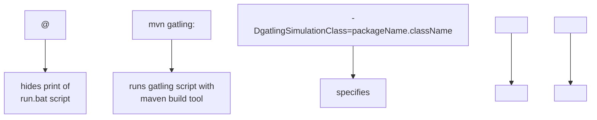

# Gatling PPDM
Gatling PPDM (Power Protect Data Manager) is a Maven Gatling project that assess the performance of different APIs hosted by the APSS microservice running on the PPDM server.

## Getting Started
Follow the steps below to run this project.

### Prerequisites
Gatling PPDM includes a command line script (_**run.bat**_) to improve its automation capabilities.
_**run.bat**_:
```
@mvn gatling:test -Dgatling.simulationClass=packageName.className -Ddatafile="datafile.csv" -Dusername="username" -Dpassword="password"
```

### Installation
1. Clone the repo
```
git clone https://github.com/joshuajerome/Gatling-PPDM.git
```
2. Open a terminal window
3. Navigate into the directory where the cloned repo exists
4. Execute 
      - _**run.bat**_ script (Windows)
      - _**run.sh**_ script (Mac)


