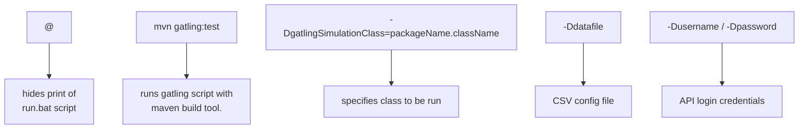

# Gatling PPDM
Gatling PPDM (Power Protect Data Manager) is a Maven Gatling project that assess the performance of different APIs hosted by the APSS microservice running on the PPDM server.

## Getting Started
This project does not require any external dependency download. All dependencies can be found within _**pom.xml**_.

### Prerequisites
Gatling PPDM includes a command line script (_**run.bat**_) to improve its automation capabilities.

_**run.bat**_ script:
```
@mvn gatling:test -Dgatling.simulationClass=packageName.className -Ddatafile="datafile.csv" -Dusername="username" -Dpassword="password"
```

Datafile is a _**CSV**_ config file with following parameters:

Test Suite #|REST API URI|Port #|HTTP Verb|Request Count|User/Thread Count|Request Bodies (.json)|Test Duration|IP Address
---|---|---|---|---|---|---|---|---

_Request Bodies are only required for HTTP Verb: POST_

### Installation
1. Clone the repo
```
git clone https://github.com/joshuajerome/Gatling-PPDM.git
```
2. Open a terminal window
3. Navigate into the directory where the cloned repo exists
4. Execute 
      - _**run.bat**_ script (Windows)
      - _**run.sh**_ script (Mac)

<details>
<summary>Further Documentation</summary>
<br>
put futher documentation here
</br>
</details>


## Credits
This tool was developed by **Yuxin Huang**, **Joshua Jerome**, **Kevin Kodama**, and **Edward Xia** under the supervision of **Hadi Abdo**, **Prabhash Krishnan**, and **Thao Pham**. All rights to this project belong to **Dell Technologies** 

