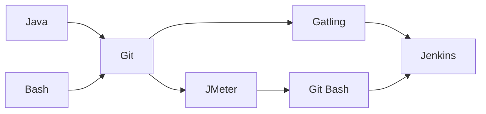

# Gatling PPDM Further Documentation
[](https://www.dell.com/en-us)
[](https://maven.apache.org/)
[](https://gatling.io/docs/gatling/)
[](https://www.jenkins.io/doc/)
[](https://www.dell.com/en-us/dt/data-protection/powerprotect-data-manager.htm#:~:text=%20PowerProtect%20Data%20Manager%20%201%20Orchestrate%20protection,Leverage%20your%20existing%20Dell%20PowerProtect%20appliances%20More%20)
[](https://github.com/joshuajerome/Gatling-PPDM)

### Table of Contents
- Gatling Project
- [About Gatling PPDM](https://github.com/joshuajerome/Gatling-PPDM/blob/master/READMORE.md#about-gatling-ppdm)
- [Project Stucture](https://github.com/joshuajerome/Gatling-PPDM/blob/master/READMORE.md#project-stucture)
  - [Prerequistites](https://github.com/joshuajerome/Gatling-PPDM/blob/master/READMORE.md#prerequisites)
  - [Installation](https://github.com/joshuajerome/Gatling-PPDM/blob/master/READMORE.md#installation)
  - src/test/java
    - [(default package)](https://github.com/joshuajerome/Gatling-PPDM/blob/master/READMORE.md#default-package)
      - Engine.java
      - IDEPathHelper.java
      - Recorder.java
    - [testone](https://github.com/joshuajerome/Gatling-PPDM/blob/master/READMORE.md#testone)  
      - TestSuite.java
      - CSVReader.java
      - Testing.java
  - [src/test/resources](https://github.com/joshuajerome/Gatling-PPDM/blob/master/READMORE.md#srctestresources)
    - data.csv
    - postBody.json
    - gatling.conf
    - recorder.conf 
  - [target](https://github.com/joshuajerome/Gatling-PPDM/blob/master/READMORE.md#target)
    - pom.xml (dependencies)
    - run.bat
- [Credits](https://github.com/joshuajerome/Gatling-PPDM/blob/master/READMORE.md#credits)

## Gatling Project

### About Gatling PPDM

Gatling PPDM is a sub-project of _**Asset Microservice Performance Analysis**_.

#### What is PPDM?
PPDM stands for Power Protect Data Manager which is a data management service that allows users to manage their backups.

#### A brief overview of Asset Microservice Performance Analysis:
- Problem Statement:
  - Assess the performance of the APIs hosted by the APSS microservice running on the PPDM server.
- Objectives:
  - Build a performance testing framework for the APSS microservice.
  - Evaluate throughput, latency, workload efficiency, and response times.
- Deliverables:
  - Performance testing framework to simulate users and spin up threads.
  - Automate load testing for different PPDM APIs.
  - Configurations are passed as parameters through a CSV file.

Gatling (and Jmeter) was one of the researched performance testing tools which seemed to address the objectives and deliverables of the project. Unable to superficially discern which framework was more effecient, a larger project was divided into two subprojects: Gatling PPDM and JMeter PPDM. Checkout [JMeter PPDM](https://github.com/yuxinhuang/jmeter-ppdm-maven) here.

Upon extensive testing and POCs (proof of concepts), JMeter appeared to be the right option with respect to the project. Ultimately, the goal was to incorporate an automated testing framework with the team's Jenkins pipeline.

A simple flow diagram of the project: 


- Bash and primarily Java were the two languages used in either project.
- Both teams used a shared Git workspace for collaborative source control.
- JMeter team additionally required the use of git-bash to execute their command line scripts.
- Both sub-projects were incorporated into the team's Jenkins pipeline.

[(back to top)](https://github.com/joshuajerome/Gatling-PPDM/blob/master/READMORE.md#gatling-ppdm-further-documentation)

### Project Stucture

- Tree Diagram

  ```
  ├── Gatling-PPDM
  │   └──  src
  │       ├── main
  |       |   └── java
  │       └── test
  |           ├── java
  |           |   ├── (default package)
  |           |   └── testone
  |           |       ├── Testing.java
  |           |       ├── TestSuite.java
  |           |       └── CSVReader.java
  |           └── resources
  |                   ├── data.csv
  |                   ├── postBody.json
  |                   ├── logback-test.xml
  |                   ├── gatling.conf
  |                   └── recorder.conf
  ├── target
  |   ├── pom.xml
  |   ├── run.bat
  |   ├── test.eml
  |   └── test.userlibraries
  ├── JRE System Library [JavaSE-1.8]
  ├── Maven Dependencies
  ├── README.md
  └── .gitignore
  ```
[(back to top)](https://github.com/joshuajerome/Gatling-PPDM/blob/master/READMORE.md#gatling-ppdm-further-documentation)
  
### Prerequisites
Gatling PPDM includes a command line script (_**run.bat**_) to improve its automation capabilities.
Requirements for this project include an updated _**run.bat**_ script and correctly formatted _**data.csv**_ file (see below).

- _**run.bat**_ script:
    ```
    @mvn gatling:test -Dgatling.simulationClass=packageName.className -Ddatafile="data.csv" -Dusername="username" -Dpassword="password"
    ```
    ```mermaid
    flowchart TD;
        A["@"]-->B["hides print of
        run.bat script"];
        C["mvn gatling:test"]-->D["runs gatling script with 
        maven build tool."];
        E["-DgatlingSimulationClass=packageName.className"]-->F["specifies class to be run"];
        G["-Ddatafile"]-->H["CSV config file"];
        I["-Dusername / -Dpassword"]-->J["API login credentials"];
    ```
- _**data.csv**_ is a configuration file with the following parameters:

    Test Suite #|REST API URI|Port #|HTTP Verb|Request Count|User/Thread Count|Request Bodies (.json)|Test Duration|IP Address
    ---|---|---|---|---|---|---|---|---

    > __Note__ 
    > _Request Bodies are only required for HTTP Verb: POST. Request Bodies provided for other HTTP Verbs will not be used._

    **Example CSV**:
    ```
    1,/some/uri/path,80,GET,10,50,,12.345.67.891
    2,/another/uri/path,443,POST,10,50,postBody.json,12.345.67.891
    ```
> __Warning__ _Configuration files must be placed into **src/test/resources** folder within the project or else they cannot be accessed_

### Installation
1. Clone the repo
```
git clone https://github.com/joshuajerome/Gatling-PPDM.git
```
2. Open a terminal window
3. Navigate into the directory where the cloned repo exists
4. Execute 
      - _**run.bat**_ script (Windows)
      - _**run.sh**_ script (Mac)

[(back to top)](https://github.com/joshuajerome/Gatling-PPDM/blob/master/READMORE.md#gatling-ppdm-further-documentation)

## Packages

### src/test/java
This directory contains all Java packages.

### (default package)
Default package comes with all Gatling projects.  

- #### [Engine.java](https://github.com/joshuajerome/Gatling-PPDM/blob/master/src/test/java/Engine.java)
	**Engine** class compiles maven resources and binaries and adds the necessary compenents to their respective directories. This is where the ```main()``` is located, so when Gatling runs, this is essentially what is executed, ```Gatling.fromMap(props.build());``` builds the packages where code is written.

- #### [IDEPathHelper.java](https://github.com/joshuajerome/Gatling-PPDM/blob/master/src/test/java/IDEPathHelper.java)
	Reads in gatling and recorder configuration files. These configuration files allow users to customize different criteria that Gatling uses to perfrom tests. Read more in [resources](https://github.com/joshuajerome/Gatling-PPDM/blob/master/READMORE.md#srctestresources).

- #### [Recorder.java](https://github.com/joshuajerome/Gatling-PPDM/blob/master/src/test/java/Recorder.java)
	**Recorder** class is nearly identical to **Engine** class, except **Recorder** can be launched from command line, and opens up a very simple GUI. For the purposes of this project, the Recorder GUI was not used, as the requests made were highly customized. 

[(back to top)](https://github.com/joshuajerome/Gatling-PPDM/blob/master/READMORE.md#gatling-ppdm-further-documentation)

### testone
Package created for simulation class development. 

- ### TestSuite.java

_**data.csv**_ file is a collection of Test Suites, and each Test Suite has several parameters. This scenario can be viewed object-orientedly by making a TestSuite class and the remaining parameters properties of that class. 

Each test suite will instantiate TestSuite through the following constructor:

```java
TestSuite (int id, String restApiUri, int port, HTTPMethod method, int requestCount, int threadCount, String body, int testDuration, String ip) 
{
  ...
}
```

Considering HTTP verbs as types, a HTTPMethod enumeration is created for all HTTP verbs:

```java
/* Can incorporate several HTTP Verbs */

enum HTTPMethod {
	GET,
	POST;
}
```

For **POST** requests, TestSuite class allows for two different methods of storing the necessary request body.

1. Base 64 decryption:

  Input to _**data.csv**_ request body must be a Base 64 _**encryption**_ of the entire body. 
  ```java
  byte[] decodedBytes = Base64.getDecoder().decode(body);
  this.requestBody = new String(decodedBytes);
  ```
2. File Reading:

  **getPostBody** and **fileToString** method work in tandem to read and store all given request body locations.
  
  ```java
  private void getPostBody() {
    	String[] arr = this.body.split("/");
    	for (String file : arr) {
    		requestBody.add(fileToString(file));
    	}
    }
    
    private String fileToString(String location) {
    	StringBuilder stringBuilder = new StringBuilder();
    	ClassLoader classLoader = Thread.currentThread().getContextClassLoader();
    	InputStream inputStream = classLoader.getResourceAsStream(location);
    	BufferedReader bufferedReader = new BufferedReader(new InputStreamReader(inputStream));
    	String fileAsString;
    	try {
    		while ((fileAsString = bufferedReader.readLine()) != null) {
    			stringBuilder.append(fileAsString);
    		}
    	} catch (Exception e) {
    		e.printStackTrace();
    	}
    	return stringBuilder.toString();
    }
  ```
  These functions are then called in the main constructor on the requestBody parameter.
  
  Input to _**data.csv**_ request body(s) must be the filename _**and**_ must be located within the _**src/test/resources**_ folder.
  ```java
	try {
            getPostBody();
        } catch(Exception e) {
            e.printStackTrace();
        }
  ```
Currently, the _file reading_ method is implemented as encrypting a request body within _**data.csv**_ seemed to minutely slow down the automation process.

[(back to top)](https://github.com/joshuajerome/Gatling-PPDM/blob/master/READMORE.md#gatling-ppdm-further-documentation)

- ### CSVReader.java

**CSVReader** streams on _**data.csv**_ and splits the file by lines. Each line is then passed into the **TestSuite** constructor, and all **TestSuite** objects are collected into a list of test suites.

```java
private static List<TestSuite> tests;

public static List<TestSuite> processFile (String filename) {
	/* initializes a comma delimeter to traverse comma seperated values */
	Pattern pattern = Pattern.compile(",");
	
	/* pulls resource from project */
	ClassLoader cl = Thread.currentThread().getContextClassLoader();
	InputStream  is = cl.getResourceAsStream(filename);
	
	try (Stream<String> lines = new BufferedReader(new InputStreamReader(is)).lines()) {
			tests = lines.map(line -> {
			String[] arr = pattern.split(line);
			return new TestSuite(
				Integer.parseInt(arr[0]),
				arr[1],
				Integer.parseInt(arr[2]),
				HTTPMethod.valueOf(arr[3]),
				Integer.parseInt(arr[4]),
				Integer.parseInt(arr[5]),
				arr[6],
				Integer.parseInt(arr[7]),
				arr[8]
			);
		}).collect(Collectors.toList());
			is.close();
	} catch (Exception e) {
		System.out.println("Caught exception: " + e.getMessage());
	}
	return tests;
}
```
>__Note__ CSVReader works exclusively with the TestSuite constructor.
> To advocate for more parameters in this model, we would need to add a new field to the TestSuite constructor.

[(back to top)](https://github.com/joshuajerome/Gatling-PPDM/blob/master/READMORE.md#gatling-ppdm-further-documentation)

- ### Testing.java

**Testing** class is where all simulation code is written.

**Testing** first gets _**data.csv**_ and stores all test suites into a list:
```java
private List<TestSuite> tests = CSVReader.processFile(getDataFile("datafile"));

private String getDataFile(String name) {
	String datafile = System.getProperty(name);

	if (datafile == null || datafile.length() == 0) {
		throw new RuntimeException("*** No Given " + name + " ***");
	}
	return datafile;
}
```
Next, **Testing** tries to grab user authetication credentials:
```java
private String credentials;

private String getCredentials() throws Exception {
	String username = System.getProperty("username");
	String password = System.getProperty("password");
	if (username == null || password == null) {
		throw new Exception("missing credentials");
	}
	String credentials = "{\"username\":\"" + username
		+ "\",\"password\":\"" 
		+ password + "\"}";
	return credentials;
}	
```
For **POST** requests specifically, recall that request bodies are necessary. With respect to the APIs hosted by APSS microservice, **POST** request bodies contain an _**agent reference ID**_, a _**natural ID**_, and a _**name**_. **IDs** are stored as UUIDs, and the **name** is stored as a String. Each of these fields must be unique for every **POST** request that hits the PPDM server. Thus, a new request body (or post body) must be generated for each request.

The following code generates a new post body:
```java
private String getNewPost(String currentPost) {
	String newPost = "";
	try {
		/* Converts JSON File to Java Map using GSON */
		Gson gson = new Gson();
		Map<?, ?> map = gson.fromJson(currentPost, Map.class);

		/* Creates unique agent ref ID */
		Map<String, String> agentRef = (Map<String, String>)map.get("agentRef");
		agentRef.put("id",UUID.randomUUID().toString());

		/* Creates & replaces unique naturalId */
		ArrayList<String> naturalIds = (ArrayList<String>)map.get("naturalIds");
		naturalIds.remove(0);
		naturalIds.add(UUID.randomUUID().toString());

		/* Changes Application Host Name */
		Map<String, String> temp = (Map<String, String>)map;
		temp.replace("name", "Application Host " + counter.getAndIncrement());			

		/* Converts Java Map back to JSON File */
		newPost = gson.toJson(map);
		// System.out.println("Agent Id: " + agentRef.get("id") + "\n" + newPost);
	} catch (Exception e) {
		e.printStackTrace();
	}
	return newPost;
}
```
The first block of code within the try block introduces the first external dependency used within the project: GSON, a java library created by Google. See [dependencies](https://github.com/joshuajerome/Gatling-PPDM/blob/master/READMORE.md#target) for more on GSON.

**getNewPost()** method is called within a function called **runScenarios**. 

This function:
1. streams on the list of TestSuite
2. establishes a HTTP connection to PPDM server
3. performs HTTP requests based on the HTTP verb

Stream:
```java
private void runScenarios() {
	tests.stream().forEach(ts -> { ... }
}
```
Establish HTTP connection:
```java
httpProtocol = HttpDsl.http
		.baseUrl("https://" + ts.ip)
		.acceptHeader("application/json")
		.userAgentHeader("Gatling Performance Test");
```
A new HTTP connection is required for each **TestSuite**. Lack of HTTP Connection results in a [socket timeout exception](https://docs.oracle.com/javase/7/docs/api/java/net/SocketTimeoutException.html).
A switch statement switches on HTTPmethod for each test suite.

HTTP Verb **GET**:
```java
/* HTTP verb: GET */
	case GET:
		/* Initialize GET ChainBuilder with .get() */
		get = exec(http("HTTP Request: GET")
				.get(ts.uri.toString())
				.header("Authorization", session -> session.getString("token_type") 
						+ " " + session.getString("access_token"))
				);
		/* Creates unique scenario for each GET*/
		getScn = scenario("Test Suite # " 
						+ ts.id + "::" 
						+ ts.HTTPmethod
						+ " "
						+ ts.uri.toString())
						.exec(get);

		/* Accumulate scenario into Population Builder List*/
					scnList.add(getScn.injectClosed(rampConcurrentUsers(0).to(ts.requestCount).during(java.time.Duration.ofSeconds(ts.testDuration)))
.protocols(httpProtocol));

	break;
```
**GET** request traditionally do not require a login, as there is no exchange interaction with the tagert API. **GET** requests may fail if the IP/URI is incorrect or a VPN connection is not established for entreprise server APIs.

HTTP Verb **POST**:
```java
case POST:
					
	/* Makes sure that there are unique bodies for each request
	 */
	  Iterator<Map<String, Object>> bodyFeeder =
	  Stream.generate((Supplier<Map<String, Object>>) () -> {
	      String body = getNewPost(ts.requestBody);
	      return Collections.singletonMap("body", body);
	    }
	  ).iterator();

	  Iterator<Map<String, Object>> authTokenFeeder =
			  Stream.generate((Supplier<Map<String, Object>>) () -> {
			      return Collections.singletonMap("token", access_token);
			    }
			  ).iterator();

	  /* Get credentials */
	  try {
			credentials = getCredentials();
		} catch (Exception e) {
			return;
		}
```
**POST** requests require a feeder ```.feed()``` to take in a request body and authentication, hence the Iterator feeders above. Unlike **GET** requests, 

**POST** requests require a login request as there is an exchange interaction with the target APIs. Only a single login is required in this model, as simulated users share the same credentials.
```java
	  /* Create login scenario */
		loginScn = scenario("Login")
				.exec(
			http("login request")
			.post("*Confidential*")
			.header("content-type","application/json")
			.body(StringBody(credentials))
			.check(jmesPath("access_token").ofString().saveAs("access_token"))
		    .check(jmesPath("token_type").ofString().saveAs("token_type"))
			 )
			.exec(session -> {
				access_token = session.getString("access_token");
				token_type = session.getString("token_type");
			    return session;
		    });
```
The login scenario returns a session of saved values, which are sequentially used by the **POST** scenario.
```java
	/* Create post scenario */
	postScn = scenario("Test Suite # " 
		+ ts.id + "::" 
		+ ts.HTTPmethod
		+ " "
		+ ts.uri.toString())
		.repeat(ts.requestCount, "index").on(
			 feed(bodyFeeder)
			.feed(authTokenFeeder)
			.exec(http("HTTP Request: POST")
				.post(":" + ts.port + ts.restApiUri)
				.header("Authorization", "bearer" 
						+ " " + "#{token}")
				.body(StringBody("#{body}")).asJson()
				));

	/* Add login scenario and then accumulate post scenarios into Population Builder List */
	scnList.add(loginScn.injectClosed(constantConcurrentUsers(1).during(java.time.Duration.ofSeconds(1)))
	  .andThen(
postScn.injectClosed(rampConcurrentUsers(1).to(ts.threadCount).during((java.time.Duration.ofSeconds(ts.testDuration))))
	 .protocols(httpProtocol)));
break;
}});
```
A scenario is the actual simulation of users, concurrent users in this model, injected over time. Each _scenario_ is of type PopulationBuilder and are all collected into a PopulationBuilder list.

Ultimately, gatling is packaged with a ```setUp()``` method that takes in a PopulationBuilder or collection of PopulationBuilder. Here, the list of PopulationBuilder is passed as a parameter, and runs on the established HTTP protocol.
```java
{
	runScenarios();	
	setUp(scnList).protocols(httpProtocol);

}
```
_**Confidential**_ --> **PPDM uris are for confidential internal use only.**

[(back to top)](https://github.com/joshuajerome/Gatling-PPDM/blob/master/READMORE.md#gatling-ppdm-further-documentation)

### src/test/resources
This directory contains all the resources used within the project.
- ### data.csv
	_**data.csv**_ is the configuration file passed into **CSVReader** and is required for the functionality of this project. For instructions and examples on how to format _**data.csv**_, see [prequisites](https://github.com/joshuajerome/Gatling-PPDM/blob/master/READMORE.md#prerequisites). 
- ### postBody.json
	_**postBody.json**_ is the request body required for **POST** requests. Below is an example postBody.json.
	```json
	{
	    "naturalIds": ["78414903-fa02-40f4-a9cc-ccd9051fc985"],
	    "name": "name 1",
	    "type": "type",
	    "categories": ["category1","category2"],
	    "version": "version",
	    "hostname": "some.host.name.com",
	    "addresses": [{
		"value": "12.23.456.78",
		"type": "XCV1"
	    }],
	    "agentRef": {"id": "48f63618-014b-42fb-a688-96ce446ad5cd"}
	}
	```
	>__Note__ the following fields are used within **Testing** class: naturalIds, name, agentRef.
- ### gatling.conf
	**gatling.conf** is a user-customizable configuration file created by Gatling which offers several customizations. Visit [gatling.conf](https://github.com/joshuajerome/Gatling-PPDM/blob/master/src/test/resources/gatling.conf) to view this file.
- ### recorder.conf
	**recorder.conf** is a user-customizable configuration file created by Gatling which offers serveral customizations. Visit [recorder.conf](https://github.com/joshuajerome/Gatling-PPDM/blob/master/src/test/resources/recorder.conf) to view this file.

[(back to top)](https://github.com/joshuajerome/Gatling-PPDM/blob/master/READMORE.md#gatling-ppdm-further-documentation)

### target

- ### pom.xml
	_**pom.xml**_ file contains all dependencies for the project. Excluding the requried Maven and Gatling dependency/plugins, this project used GSON dependency and SureFire external plugin.
	```xml
	<!-- https://mvnrepository.com/artifact/com.google.code.gson/gson -->
	<dependency>
	    <groupId>com.google.code.gson</groupId>
	    <artifactId>gson</artifactId>
	    <version>2.8.1</version>
	</dependency>

	 <plugin>
	  <groupId>org.apache.maven.plugins</groupId>
	  <artifactId>maven-surefire-plugin</artifactId>
	  <version>3.0.0-M7</version>
	  <configuration>
		    <forkCount>0</forkCount>
		    <!--reuseForks>true</reuseForks-->
		    <!--forkMode>once</forkMode-->
		    <argLine>-Xmx1024m -XX:MaxPermSize=256m</argLine>
		  </configuration>
	</plugin>
	```
	To see all dependencies and plugins, see [pom.xml](https://github.com/joshuajerome/Gatling-PPDM/blob/master/pom.xml).
- ### run.bat
	_**run.bat**_ is the batch script on which the project runs and is required for the functionality of this project. For instructions and examples on how to format _**run.bat**_, see [prequisites](https://github.com/joshuajerome/Gatling-PPDM/blob/master/READMORE.md#prerequisites). 

[(back to top)](https://github.com/joshuajerome/Gatling-PPDM/blob/master/READMORE.md#gatling-ppdm-further-documentation)

## Credits 
This tool was developed by **Yuxin Huang**, **Joshua Jerome**, **Kevin Kodama**, and **Edward Xia** under the supervision of **Hadi Abdo**, **Prabhash Krishnan**, and **Thao Pham**. All rights to this project belong to **Dell Technologies** 

