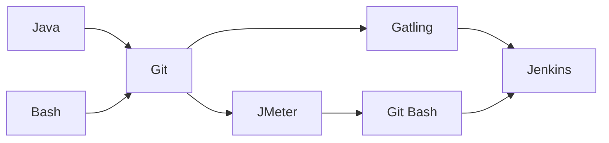

# Gatling PPDM Further Documentation
[](https://www.dell.com/en-us)
[](https://maven.apache.org/)
[](https://gatling.io/docs/gatling/)
[](https://www.jenkins.io/doc/)
[](https://www.dell.com/en-us/dt/data-protection/powerprotect-data-manager.htm#:~:text=%20PowerProtect%20Data%20Manager%20%201%20Orchestrate%20protection,Leverage%20your%20existing%20Dell%20PowerProtect%20appliances%20More%20)
[](https://github.com/joshuajerome/Gatling-PPDM)

### Table of Contents
- Gatling Project
- [About Gatling PPDM](https://github.com/joshuajerome/Gatling-PPDM/blob/master/READMORE.md#about-gatling-ppdm)
- [Project Stucture](https://github.com/joshuajerome/Gatling-PPDM/blob/master/READMORE.md#project-stucture)
  - [Prerequistites](https://github.com/joshuajerome/Gatling-PPDM/blob/master/READMORE.md#prerequisites)
  - [Installation](https://github.com/joshuajerome/Gatling-PPDM/blob/master/READMORE.md#installation)
  - src/test/java
    - [(default package)](https://github.com/joshuajerome/Gatling-PPDM/blob/master/READMORE.md#default-package)
      - Engine.java
      - IDEPathHelper.java
      - Recorder.java
    - [testone](https://github.com/joshuajerome/Gatling-PPDM/blob/master/READMORE.md#testone)  
      - Testing.java
      - TestSuite.java
      - CSVReader.java
  - [src/test/resources](https://github.com/joshuajerome/Gatling-PPDM/blob/master/READMORE.md#srctestresources)
    - data.csv
    - postBody.json
    - gatling.conf
    - recorder.conf 
  - [target](https://github.com/joshuajerome/Gatling-PPDM/blob/master/READMORE.md#target)
    - pom.xml
    - run.bat
    - test.eml
    - test.userLibraries
- [Credits](https://github.com/joshuajerome/Gatling-PPDM/blob/master/READMORE.md#credits)

## Gatling Project

### About Gatling PPDM

Gatling PPDM is a sub-project of _**Asset Microservice Performance Analysis**_.

#### What is PPDM?
PPDM stands for Power Protect Data Manager which is a data management service that allows users to manage their backups.

#### A brief overview of Asset Microservice Performance Analysis:
- Problem Statement:
  - Assess the performance of the APIs hosted by the APSS microservice running on the PPDM server.
- Objectives:
  - Build a performance testing framework for the APSS microservice.
  - Evaluate throughput, latency, workload efficiency, and response times.
- Deliverables:
  - Performance testing framework to simulate users and spin up threads.
  - Automate load testing for different PPDM APIs.
  - Configurations are passed as parameters through a CSV file.

Gatling (and Jmeter) was one of the researched performance testing tools which seemed to address the objectives and deliverables of the project. Unable to superficially discern which framework was more effecient, a larger project was divided into two subprojects: Gatling PPDM and JMeter PPDM. Checkout [JMeter PPDM](https://github.com/yuxinhuang/jmeter-ppdm-maven) here.

Upon extensive testing and POCs (proof of concepts), JMeter appeared to be the right option with respect to the project. Ultimately, the goal was to incorporate an automated testing framework with the team's Jenkins pipeline.

A simple flow diagram of the project: 


- Bash and primarily Java were the two languages used in either project.
- Both teams used a shared Git workspace for collaborative source control.
- JMeter team additionally required the use of git-bash to execute their command line scripts.
- Both sub-projects were incorporated into the team's Jenkins pipeline.

### Project Stucture

- Tree Diagram

  ```
  ├── Gatling-PPDM
  │   └──  src
  │       ├── main
  |       |   └── java
  │       └── test
  |           ├── java
  |           |   ├── (default package)
  |           |   └── testone
  |           |       ├── Testing.java
  |           |       ├── TestSuite.java
  |           |       └── CSVReader.java
  |           └── resources
  |                   ├── data.csv
  |                   ├── postBody.json
  |                   ├── gatling.conf
  |                   └── recorder.conf
  ├── target
  |   ├── pom.xml
  |   ├── run.bat
  |   ├── test.eml
  |   └── test.userlibraries
  ├── JRE System Library [JavaSE-1.8]
  ├── Maven Dependencies
  ├── README.md
  └── .gitignore
  ```
### Prerequisites
Gatling PPDM includes a command line script (_**run.bat**_) to improve its automation capabilities.
Requirements for this project include an updated _**run.bat**_ script and correctly formatted _**data.csv**_ file (see below).

- _**run.bat**_ script:
    ```
    @mvn gatling:test -Dgatling.simulationClass=packageName.className -Ddatafile="data.csv" -Dusername="username" -Dpassword="password"
    ```
    ```mermaid
    flowchart TD;
        A["@"]-->B["hides print of
        run.bat script"];
        C["mvn gatling:test"]-->D["runs gatling script with 
        maven build tool."];
        E["-DgatlingSimulationClass=packageName.className"]-->F["specifies class to be run"];
        G["-Ddatafile"]-->H["CSV config file"];
        I["-Dusername / -Dpassword"]-->J["API login credentials"];
    ```
- _**data.csv**_ is a configuration file with the following parameters:

    Test Suite #|REST API URI|Port #|HTTP Verb|Request Count|User/Thread Count|Request Bodies (.json)|Test Duration|IP Address
    ---|---|---|---|---|---|---|---|---

    > __Note__ 
    > _Request Bodies are only required for HTTP Verb: POST. Request Bodies provided for other HTTP Verbs will not be used._

    **Example CSV**:
    ```
    1,/some/uri/path,80,GET,10,50,,12.345.67.891
    2,/another/uri/path,443,POST,10,50,postBody.json,12.345.67.891
    ```
> __Warning__ _Configuration files must be placed into **src/test/resources** folder within the project or else they cannot be accessed_

### Installation
1. Clone the repo
```
git clone https://github.com/joshuajerome/Gatling-PPDM.git
```
2. Open a terminal window
3. Navigate into the directory where the cloned repo exists
4. Execute 
      - _**run.bat**_ script (Windows)
      - _**run.sh**_ script (Mac)

## Packages

### src/test/java
This directory contains all Java packages.

### (default package)
Default package comes with all Gatling projects.  

- #### Engine.java

- #### IDEPathHelper.java

- #### Recorder.java

### testone
Package created for simulation class development. 

- ### TestSuite.java

_**data.csv**_ file is a collection of Test Suites, and each Test Suite has several parameters. This scenario can be viewed object-orientedly by making a TestSuite class and the remaining parameters properties of that class. 

Each test suite will instantiate TestSuite through the following constructor:

```java
TestSuite (int id, String restApiUri, int port, HTTPMethod method, int requestCount, int threadCount, String body, int testDuration, String ip) 
{
  ...
}
```

Considering HTTP verbs as types, a HTTPMethod enumeration is created for all HTTP verbs:

```java
/* Can incorporate several HTTP Verbs */

enum HTTPMethod {
	GET,
	POST;
}
```

For POST requests, TestSuite class allows for two different methods of storing the necessary request body.

1. Base 64 decryption:

  Input to _**data.csv**_ request body must be a Base 64 _**encryption**_ of the entire body. 
  ```java
  byte[] decodedBytes = Base64.getDecoder().decode(body);
  this.requestBody = new String(decodedBytes);
  ```
2. File Reading:

  Input to _**data.csv**_ request body must be the filename _**and**_ must be located within the _**src/test/resources**_ folder.
  ```java
      try {
        StringBuilder sb = new StringBuilder();
	
	/* pulls resource from project */
        ClassLoader cl = Thread.currentThread().getContextClassLoader();
        InputStream  is = cl.getResourceAsStream(body);	
        BufferedReader br = new BufferedReader(new InputStreamReader(is));
        
	/* streams entire request body into a single String */
	String read;
        try {
          while((read = br.readLine()) != null) {
            sb.append(read);
          }
        }
        catch(Exception e) {
          e.printStackTrace();
        }
        this.requestBody = sb.toString();
      }
      catch(Exception e) {
        e.printStackTrace();
      }
  ```
Currently, file reading method is implemented as encrypting a request body within _**data.csv**_ seemed to minutely slow down the automation process.

- ### CSVReader.java

**CSVReader** streams on _**data.csv**_ and splits the file by lines. Each line is then passed into the **TestSuite** constructor, and all **TestSuite** objects are collected into a list of test suites.

```java
private static List<TestSuite> tests;

public static List<TestSuite> processFile (String filename) {
	/* initializes a comma delimeter to traverse comma seperated values */
	Pattern pattern = Pattern.compile(",");
	
	/* pulls resource from project */
	ClassLoader cl = Thread.currentThread().getContextClassLoader();
	InputStream  is = cl.getResourceAsStream(filename);
	
	try (Stream<String> lines = new BufferedReader(new InputStreamReader(is)).lines()) {
			tests = lines.map(line -> {
			String[] arr = pattern.split(line);
			return new TestSuite(
				Integer.parseInt(arr[0]),
				arr[1],
				Integer.parseInt(arr[2]),
				HTTPMethod.valueOf(arr[3]),
				Integer.parseInt(arr[4]),
				Integer.parseInt(arr[5]),
				arr[6],
				Integer.parseInt(arr[7]),
				arr[8]
			);
		}).collect(Collectors.toList());
			is.close();
	} catch (Exception e) {
		System.out.println("Caught exception: " + e.getMessage());
	}
	return tests;
}
```
>__Note__ CSVReader works exclusively with the TestSuite constructor.


- ### Testing.java

```

```

### src/test/resources

- ### data.csv

- ### postBody.json

- ### gatling.conf

- ### recorder.conf

### target

- ### pom.xml

- ### run.bat

- ### test.eml

- ### test.userlibraries

### JRE System Library [JavaSE-1.8]

### Maven Dependencies

### .gitignore

## Credits
This tool was developed by **Yuxin Huang**, **Joshua Jerome**, **Kevin Kodama**, and **Edward Xia** under the supervision of **Hadi Abdo**, **Prabhash Krishnan**, and **Thao Pham**. All rights to this project belong to **Dell Technologies** 

